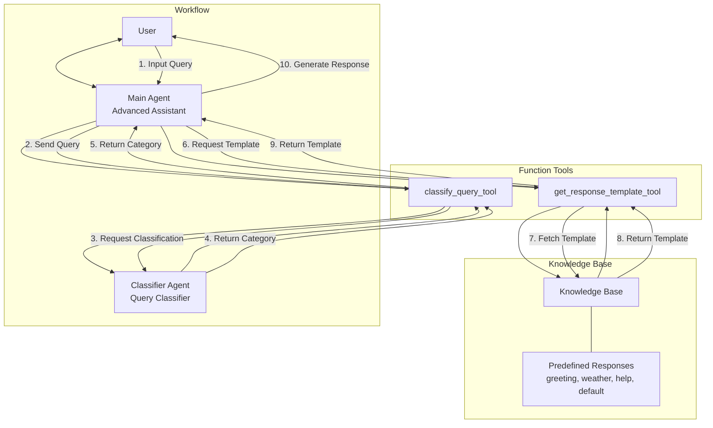

# OpenAI Agent Hello World

A simple Hello World example using the OpenAI Agent SDK.

## Prerequisites

- Python 3.8 or higher
- OpenAI API key

## Setup

1. Clone this repository:
   ```
   git clone <repository-url>
   cd openai-agent
   ```

2. Create and activate a virtual environment:
   ```
   python -m venv venv
   source venv/bin/activate  # On Windows: venv\Scripts\activate
   ```

3. Install the required packages:
   ```
   pip install -r requirements.txt
   ```

4. Set your OpenAI API key as an environment variable:
   ```
   export OPENAI_API_KEY=your-api-key-here  # On Windows: set OPENAI_API_KEY=your-api-key-here
   ```

## Running the Agents

### Advanced Agent

For a more complex example, run the advanced agent:

```
python advanced_agent.py
```

The advanced agent demonstrates:
- Handling different types of queries using tools
- Providing context-specific responses based on query classification
- Using function tools to extend agent capabilities
- Interactive conversation with the user

## Understanding the Code

### Advanced Agent Architecture



### Advanced Agent Details

The `advanced_agent.py` file demonstrates more complex agent capabilities:

1. It creates a main agent with tools for handling different types of queries
2. Implements a knowledge base with predefined responses for different query types
3. Creates a specialized classifier agent that focuses solely on query classification
4. Exposes the classifier agent's functionality as a tool that the main agent can use
5. Provides a response template tool that retrieves appropriate responses from the knowledge base
6. Implements a structured workflow where the main agent:
   - Uses the classification tool to determine the query type
   - Uses the response template tool to get the appropriate template
   - Generates a response based on the template and the user's query
7. Implements an interactive conversation loop with the user
8. Demonstrates how to use function tools to extend an agent's capabilities

This implementation better leverages the agent architecture by:
- Using tools to handle specific tasks rather than just custom prompts
- Creating a more structured workflow for the agent to follow
- Separating concerns between classification and response generation
- Allowing the main agent to make decisions based on tool outputs

## Troubleshooting

If you encounter import errors, make sure:
- You've activated the virtual environment
- You've installed all dependencies from requirements.txt
- Your Python version is compatible (3.8+)

If you get API errors, check that your OpenAI API key is set correctly and has the necessary permissions.

## Further Resources

- [OpenAI Agent SDK Documentation](https://openai.github.io/openai-agents-python/)
- [OpenAI API Documentation](https://platform.openai.com/docs/api-reference)
